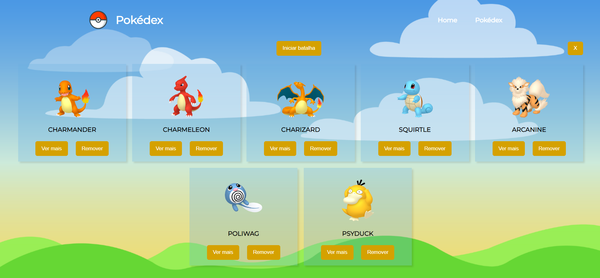

# POKEDEX
Este projeto foi desenvolvido como parte da fixação de conteúdo de ReactJS do curso de Web Full Stack da Labenu, e foi realizado utilizando a API pública PokéAPI. O projeto consiste em uma aplicação em que o usuário pode visualizar todos os tipos de Pokémons, e incluí-los em sua Pokédex. Na página inicial, é possível visualizar uma lista de Pokémons, selecionar para ver os detalhes de cada um deles (abrir página de detalhes), e adicioná-los em sua Pokédex. Já na página Pokédex, também é possível clicar para ver os detalhes do Pokémon, removê-lo da Pokédex, bem como iniciar uma batalha entre os Pokémons que estão na Pokédex.

## Quem fez?
[Francine Hahn](https://github.com/francinehahn)  
[Giovana Vieira](https://github.com/gioivieira)  
[Maria Ferro](https://github.com/mariafmf)

## Link do Surge:
https://wrong-quicksand.surge.sh/

## Funcionalidades:
- Requisição de todos os pokémons disponíveis na API;
- Botão "adicionar à pokédex" e "ver mais" em cada card de pokémon;
- Ao adicionar pokémon à pokédex, ele fica salvo no local storage e deixa de ser renderizado na página inicial;
- Botão "remover da pokedéx": pokémon deixa de ser renderizado na pokédex e volta para a página inicial;
- Botão "limpar pokédex": exclui todos os pokémons da pokédex;
- Botão "iniciar batalha": usuário pode selecionar 2 pokémons para se enfrentar; o pokémon com maior soma das stats vence;
- O projeto é responsivo para todos em tamanhos de tela. 

## Imagens:

### Versão desktop:

 

 

 

### Versão mobile:

 

 

 

 