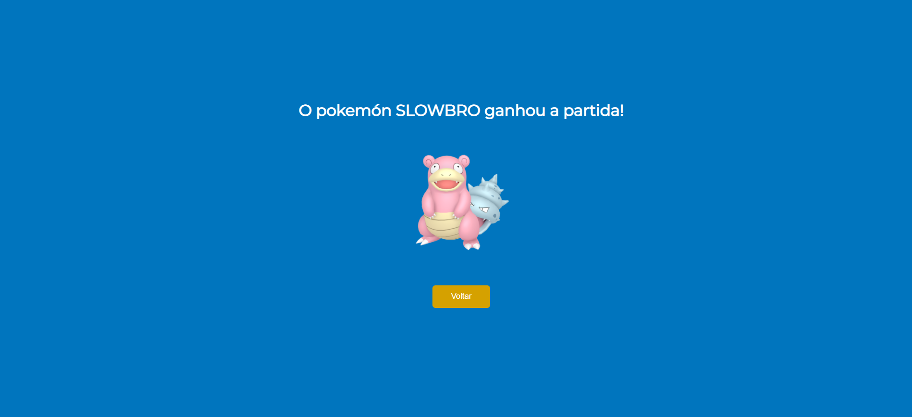
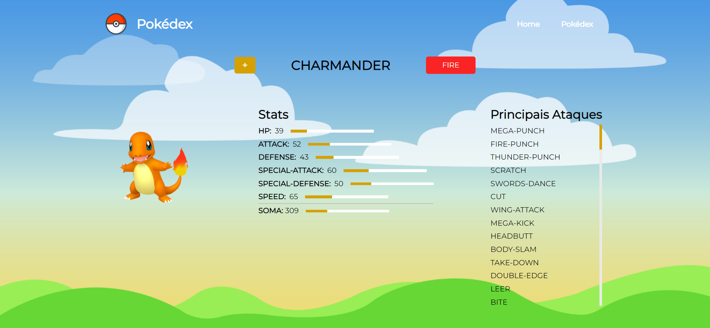

# POKEDEX
This project was developed with the intent to practice ReactJS and API consumption. The API used was the PokéAPI. In the home page, the user can see all the Pokémons, select them to get more information about their strengths and moves, and add them to their Pokédex. In the Pokédex page, the user can still see the Pokémon's details and remove them from their Pokédex. On the top of the page, it is possible to select 2 Pokémons from the Pokédex to battle against each other.

## Who made this project?
[Francine Hahn](https://github.com/francinehahn)  
[Giovana Vieira](https://github.com/gioivieira)  
[Maria Ferro](https://github.com/mariafmf)

## Link to access the project:
https://wrong-quicksand.surge.sh/

## Functionalities:
- Request of all the available Pokémons in the API;
- A button "add to the pokédex" and another button "see more" in each of the pokémon's card;
- When adding or deleting a pokémon to/from the pokédex, the information is saved on the local storage;
- A button "clear pokédex" that removes all the pokémons from the pokédex;
- A button "start battle" that allows the user to select 2 pokémons to battle against each other; the pokémon with a higher score wins;
- This project is responsive to all screen sizes. 

## Installing
<pre>
  <code>$ git clone https://github.com/francinehahn/pokedex.git</code>
</pre>

<pre>
  <code>$ cd pokedex</code>
</pre>

<pre>
  <code>$ npm install</code>
</pre>

## Images:

### Desktop version:

 

 

 

### Mobile version:

 

 

 

 
